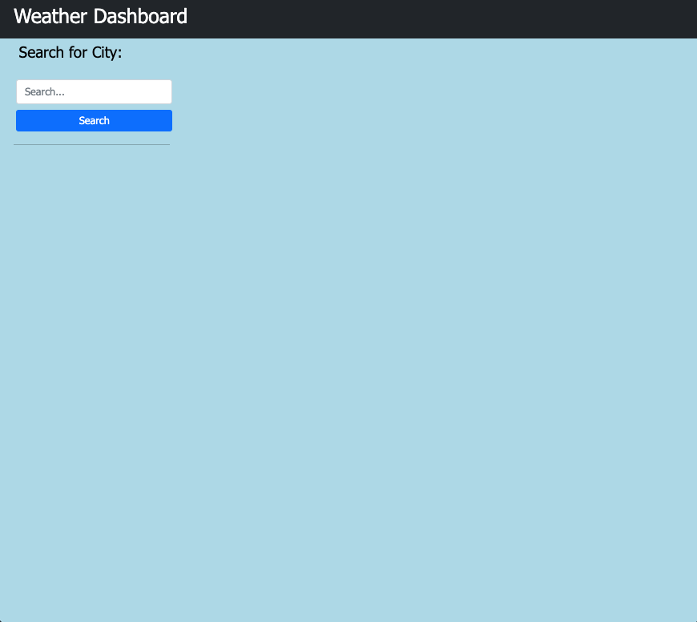
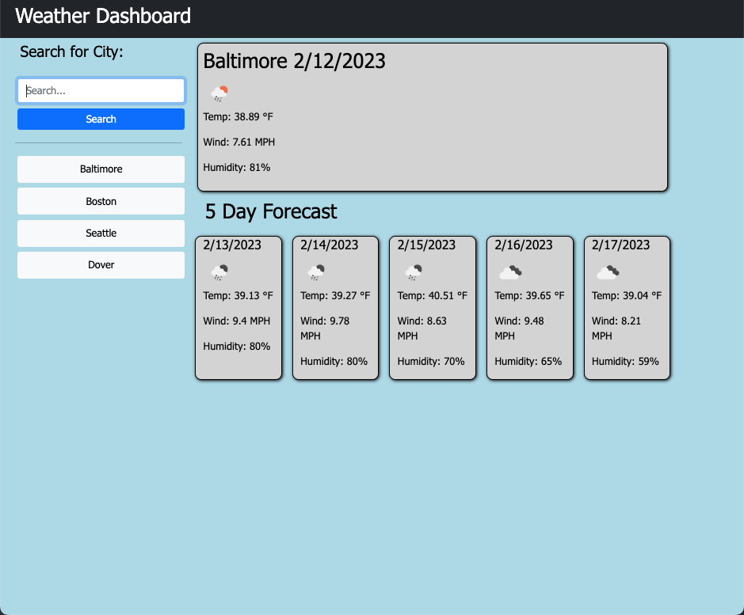

# weather-dashboard

## Description
For this weeks challenge I created a weather dashboard that will display the current weather and 5 day forecast for the city entered by the user. It utilizes the openweathermap API to retrieve data from in order to get the weather. I used local storage to store the 10 most recent searches so the user can go back and click on that city to search it again. I learned more about using fetch/retrieving data and using it to provide the user with useful information. I also got more practice using local storage to store the recent searches from the user, and finally I got to utilize jquery and bootstrap to easily traverse the DOM and stylize the webpage.

## Usage

To access this Weather Dashboard, you can run it locally by using VScode's live server plugin. Right click on index file and select `Open with live server` 

Or

This website can be ran on Github Pages using the following link [Weather Dashboard](https://brett-hicklin.github.io/weather-dashboard/)

When the website loads you will see the search bar that allows you to search for a city. Once you enter a valid city to be searched and click 'Search' you will then be shown the current temperature, wind speed, and humidity for said city, as well as a 5 day forecast with the temperature, wind speed, and humidity as well. You will also notice that when you search for a city, it will be added to a list beneath the search bar that will show your 10 most recent searches. If you click on one of those cities/buttons you will then be shown the current temperature as well as a 5 day forecast.

example screenshots showing the layout is provided below: 

